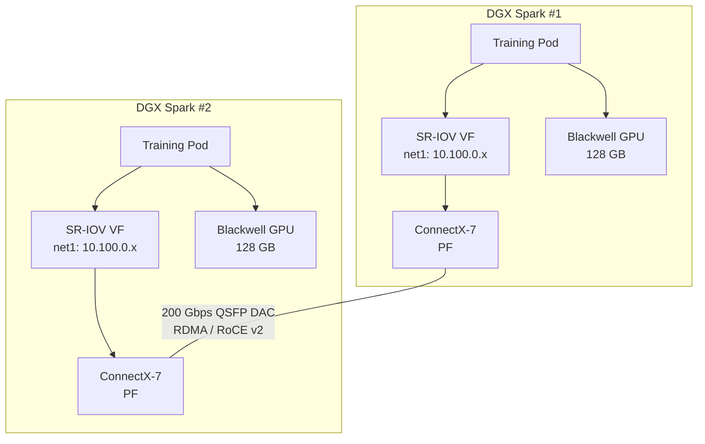

This is the most technically interesting part of the cluster, and the area where I'm actively learning the most. The goal is multi-node GPU training across the two DGX Sparks using the 200 Gbps ConnectX-7 interconnect with GPU-Direct RDMA.

## The hardware stack

Each DGX Spark has:
- **GB10 Grace Blackwell SoC** — 1 PFLOP FP4, 128 GB unified memory
- **ConnectX-7 NIC** — 200 Gbps QSFP56, SR-IOV capable, RDMA (RoCE v2)

The two units are connected point-to-point via a QSFP56 DAC cable. No switch, no hops.

## The software stack

Getting GPUs and RDMA working in Kubernetes on Talos Linux required assembling several components:

### NVIDIA Device Plugin

The [NVIDIA Device Plugin](https://github.com/NVIDIA/k8s-device-plugin) advertises GPU resources to the Kubernetes scheduler. Pods request GPUs via `nvidia.com/gpu: 1` in their resource spec. A corresponding `RuntimeClass` ensures GPU pods use the NVIDIA container runtime.

### SR-IOV Device Plugin (standalone)

This is where things get interesting. The standard approach for SR-IOV in Kubernetes is the [SR-IOV Network Operator](https://github.com/k8snetworkplumbingwg/sriov-network-operator), but **it doesn't work on Talos Linux**. The operator's config daemon expects to write to `/etc/sriov-operator/`, which doesn't exist on Talos's read-only root filesystem.

Instead, I built a **standalone DaemonSet** that:

1. Runs an **init container** that creates 4 SR-IOV Virtual Functions on each DGX Spark's ConnectX-7 NIC using `sysfs`
2. Runs the **SR-IOV Device Plugin** container that discovers the VFs and advertises them to Kubernetes as `nvidia.com/cx7_qsfp` resources (4 per node)

See the [journal entry on SR-IOV on Talos](/posts/sriov-on-talos/) for the full story.

### Multus CNI

[Multus](https://github.com/k8snetworkplumbingwg/multus-cni) is a meta-CNI that wraps Cilium and enables pods to have multiple network interfaces. On the DGX Sparks, pods can get:

- `eth0` — primary interface via Cilium (home network)
- `net1` — secondary interface via SR-IOV VF (200 Gbps QSFP link)

Multus runs as a "thick plugin" in `kube-system` with Talos-specific patches for the `/var/run/netns/` path and resource limits.

### NetworkAttachmentDefinition

The `dgx-qsfp` NetworkAttachmentDefinition configures the secondary interface:

- **IPAM:** `host-local` on subnet `10.100.0.0/24`
- **RDMA:** enabled
- **Type:** SR-IOV

## How it fits together



When a pod on DGX Spark #1 needs to communicate with a pod on DGX Spark #2 for distributed training:

1. NCCL detects the `net1` RDMA interface
2. Data transfers bypass the kernel via RDMA (RoCE v2)
3. GPU-Direct RDMA allows the GPU to read/write directly to the NIC's memory, skipping the CPU entirely

### Example pod spec

```yaml
resources:
  requests:
    nvidia.com/gpu: 1
    nvidia.com/cx7_qsfp: 1
  limits:
    nvidia.com/gpu: 1
    nvidia.com/cx7_qsfp: 1
```

With the annotation:
```yaml
annotations:
  k8s.v1.cni.cncf.io/networks: dgx-qsfp
```

### NCCL environment variables

```bash
NCCL_SOCKET_IFNAME=net1
NCCL_IB_DISABLE=0
NCCL_NET_GDR_LEVEL=5    # GPU-Direct RDMA
NCCL_DEBUG=INFO
```

## Current status

This is a work in progress. I've gotten:

- SR-IOV VFs created and advertised to Kubernetes
- Multus attaching secondary interfaces to pods
- Basic RDMA connectivity between pods on the two DGX Sparks

What I'm still working on:

- Validating GPU-Direct RDMA end-to-end with NCCL benchmarks
- Tuning NCCL parameters for optimal throughput on the 200 Gbps link
- Building a reproducible multi-node training workflow

Follow along in the [journal](/posts/).
