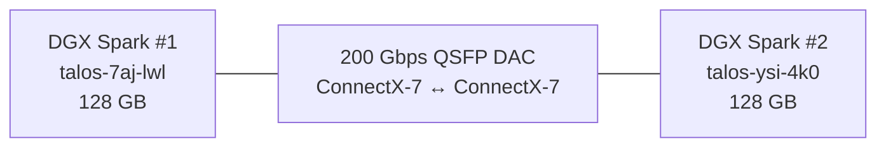
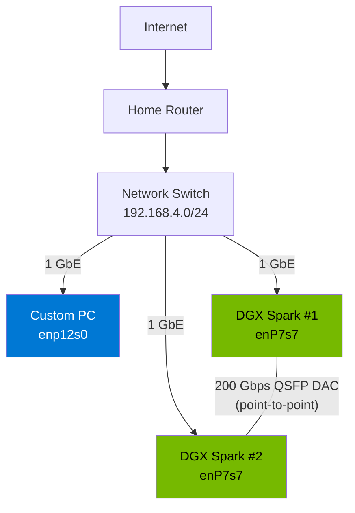

## Nodes

| Node | Hardware | CPU | RAM | Architecture |
|------|----------|-----|-----|-------------|
| `talos-76w-3r0` | Custom-built PC | AMD Ryzen 9 9950X3D (16c/32t, 3D V-Cache) | 192 GB DDR5 | AMD64 |
| `talos-7aj-lwl` | NVIDIA DGX Spark (ASUS OEM) | GB10 Grace Blackwell SoC (20c) | 128 GB unified | ARM64 |
| `talos-ysi-4k0` | NVIDIA DGX Spark (ASUS OEM) | GB10 Grace Blackwell SoC (20c) | 128 GB unified | ARM64 |

All three nodes serve as both control-plane and worker nodes.

## NVIDIA DGX Spark

The DGX Spark is NVIDIA's desktop AI workstation, built around the **GB10 Grace Blackwell** superchip:

- **1 PFLOP FP4** AI compute per unit (2 PFLOPS total across the pair)
- **128 GB unified memory** shared between CPU and GPU — no PCIe bottleneck
- **ARM64 (Grace CPU)** — 20 Cortex-A720 cores
- **ConnectX-7 NIC** — Mellanox 200 Gbps QSFP56, SR-IOV capable

The unified memory architecture means the GPU can access the full 128 GB without transfers. This matters for large model inference and fine-tuning workloads that would be memory-constrained on discrete GPU systems.

## The 200 Gbps interconnect

The two DGX Sparks are directly connected via a **QSFP56 DAC (Direct Attach Copper)** cable between their ConnectX-7 NICs. No switch in the path — it's a point-to-point 200 Gbps link.

This link supports **RDMA (Remote Direct Memory Access)** via RoCE v2, enabling GPU-Direct RDMA for NCCL multi-node training. The ConnectX-7 NICs are configured with **SR-IOV** to present Virtual Functions to pods, so containers can get direct access to the 200 Gbps link without going through the kernel network stack.

See [GPU & AI](/infrastructure/gpu/) for the full software stack that makes this work in Kubernetes.

## The Ryzen node

The custom PC fills a different role:

- **AMD Ryzen 9 9950X3D** — 16 cores / 32 threads with 3D V-Cache for cache-heavy workloads
- **192 GB DDR5** — the largest memory pool in the cluster
- **NVIDIA RTX 5070 Ti** — for AMD64 GPU workloads (CUDA, inference, dev/test)
- **AMD64** — runs workloads that don't have ARM64 builds

It handles most of the platform services (Keycloak, ArgoCD, Grafana, etc.) and can also run GPU workloads on the 5070 Ti, while the DGX Sparks focus on heavier AI training.

## Operating system

All nodes run **Talos Linux** — an immutable, API-driven Kubernetes OS. Key characteristics:

- **No SSH.** Everything is managed via the Talos API or `kubectl debug`.
- **Read-only root filesystem.** This has real implications — the SR-IOV Network Operator doesn't work on Talos because it expects to write to `/etc/`. I had to build a [standalone SR-IOV device plugin](/posts/sriov-on-talos/) instead.
- **Managed via Omni** (Sidero Labs hosted platform) for lifecycle management and upgrades.
- **Kubernetes** with containerd.

## Network topology

Each node connects to the home network via 1 GbE for management and general traffic. The 200 Gbps link is exclusively for inter-DGX GPU communication.
