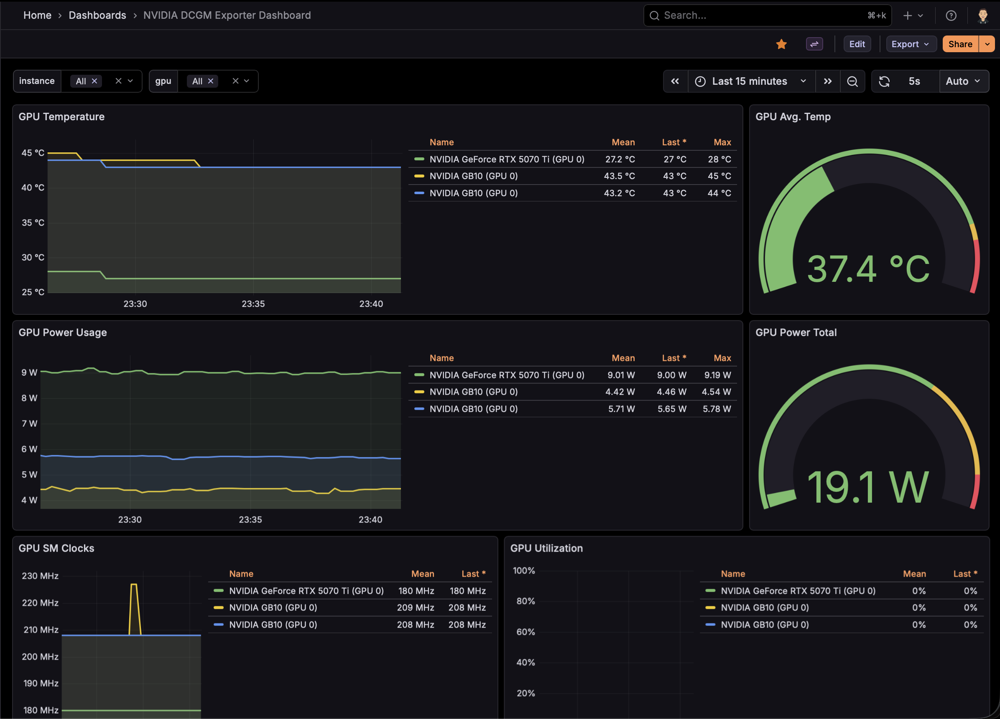

## The Setup

The cluster has three GPU nodes:
- **2x DGX Spark** — NVIDIA GB10 (Grace Blackwell SoC, ARM64, 128 GB unified memory)
- **1x Ryzen 9 workstation** — NVIDIA GeForce RTX 5070 Ti (16 GB VRAM)

I wanted a single Grafana dashboard that shows all three GPUs side by side, with clear labels for which hardware is which.

## DCGM Exporter

[DCGM](https://developer.nvidia.com/dcgm) (Data Center GPU Manager) is NVIDIA's tool for GPU telemetry. The [dcgm-exporter](https://github.com/NVIDIA/dcgm-exporter) Helm chart runs as a DaemonSet, exposing Prometheus-format metrics from every GPU node.

The key metrics it exposes:
- `DCGM_FI_DEV_GPU_TEMP` — GPU temperature
- `DCGM_FI_DEV_POWER_USAGE` — power draw in watts
- `DCGM_FI_DEV_GPU_UTIL` — GPU compute utilization
- `DCGM_FI_DEV_SM_CLOCK` — SM clock frequency
- `DCGM_FI_DEV_FB_USED` — framebuffer memory used
- `DCGM_FI_PROF_PIPE_TENSOR_ACTIVE` — tensor core utilization

One nice thing about DCGM: every metric includes a `modelName` label, so you get `NVIDIA GeForce RTX 5070 Ti` or `NVIDIA GB10` right in the time series data. No manual mapping needed.

## Scraping with VictoriaMetrics

The cluster runs [VictoriaMetrics](https://victoriametrics.com/) (via the `victoria-metrics-k8s-stack` Helm chart) instead of Prometheus. Rather than using Prometheus `ServiceMonitor` CRDs (which don't exist in this stack), I created a `VMPodScrape`:

```yaml
apiVersion: operator.victoriametrics.com/v1beta1
kind: VMPodScrape
metadata:
  name: dcgm-exporter
  namespace: dcgm-exporter
spec:
  podMetricsEndpoints:
    - port: metrics
      path: /metrics
      relabelConfigs:
        - sourceLabels: [__meta_kubernetes_pod_node_name]
          targetLabel: instance
      metricRelabelConfigs:
        - action: labeldrop
          regex: exported_pod|exported_container|exported_namespace|pod|container|endpoint|prometheus
  selector:
    matchLabels:
      app.kubernetes.io/name: dcgm-exporter
```

Two important details here:

**Node name as instance label.** By default, the `instance` label is the pod IP + port (`10.244.0.136:9400`), which is meaningless. Relabeling it to `__meta_kubernetes_pod_node_name` gives you `talos-76w-3r0` instead.

**Dropping high-cardinality labels.** DCGM reports which pod is using the GPU via `exported_pod` / `exported_container` labels. Every time a workload starts or stops, that creates a brand new time series. Combined with DaemonSet rollovers changing the `pod` label, you end up with an explosion of stale series. Dropping these labels keeps cardinality under control.

## The Dashboard

I started from [Grafana dashboard 12239](https://grafana.com/grafana/dashboards/12239-nvidia-dcgm-exporter-dashboard/) and customized it heavily.



Changes from the stock dashboard:
- **Instance variable** queries `Hostname` label instead of `instance`
- **All queries** filter on `Hostname` and include `instance!~".*:.*"` to exclude stale IP-based series
- **Legend format** uses `{{modelName}} (GPU {{gpu}})` instead of just `GPU {{gpu}}`
- **2-column layout** for the bottom panels (SM Clocks + Utilization, Tensor Cores + Framebuffer)
- **GPU Power Total gauge** rescaled from 2400W (data center scale) to 600W (homelab scale), with `lastNotNull` calc instead of `sum`
- **All dropdowns** default to "All" selected

Note: the DGX Sparks don't report `DCGM_FI_PROF_PIPE_TENSOR_ACTIVE` or `DCGM_FI_DEV_FB_USED` — the GB10's unified memory architecture doesn't support these counters.

## Provisioning via GitOps

The dashboard is provisioned as a Kubernetes ConfigMap with the `grafana_dashboard: "1"` label. Grafana's sidecar container watches for ConfigMaps with this label and automatically loads them.

This approach avoids a known issue with the `victoria-metrics-k8s-stack` chart, which doesn't allow `grafana.sidecar.dashboards.enabled` and `grafana.dashboards` to be set at the same time. By using a standalone ConfigMap instead of the chart's built-in dashboard provisioning, the sidecar stays enabled and everything works.

The full dashboard JSON, VMPodScrape, and HelmRelease are all managed via FluxCD — no manual `kubectl apply` needed (well, after the initial debugging).
